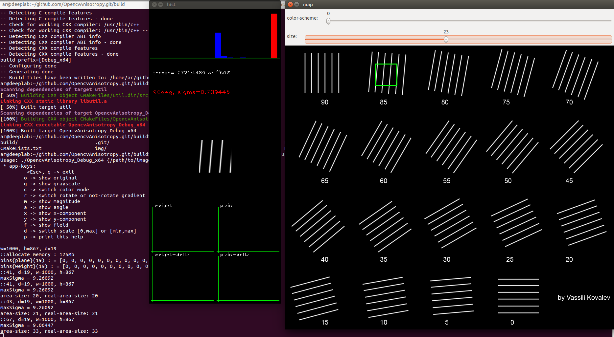
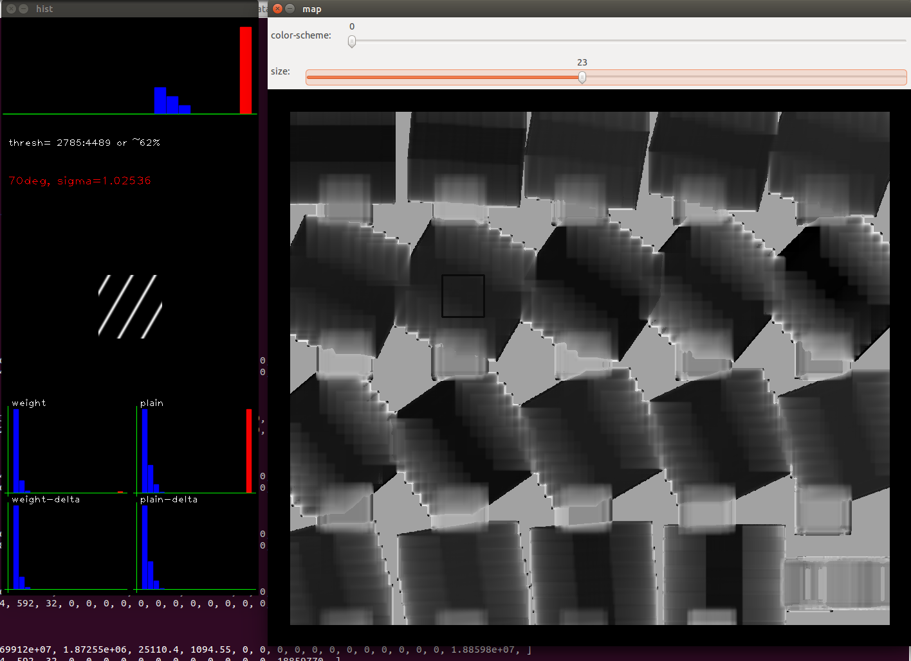

# OpencvAnisotropy
Image-anisotropy calculator and preview on OpenCV

Demo for debug histogram of gradient orientation based on OpenCV

To build

```
$ mkdir build
$ cd build/
$ cmake ..
$ make
```

To run

```
$ OpencvAnisotropy_Debug_x64 ../Lines_Various_Angles_resiz.tif 18
```

Reruiremets: [OpenCV](http://opencv.org/)





